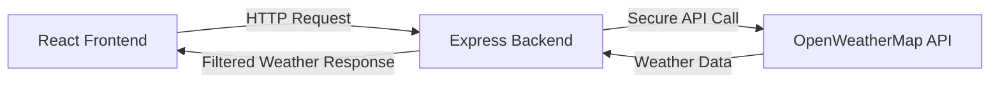
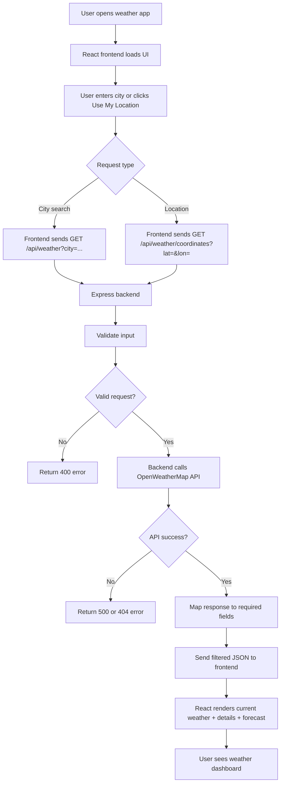

# Weather App

A full-stack weather application built with React + Vite on the frontend and Node.js + Express on the backend.

## Features

- Search weather by city name
- Get weather by current location
- View current temperature, humidity, wind speed, and feels-like temperature
- See 5-day forecast
- Dark/light mode toggle
- Loading and error states
- CORS-enabled backend API

## Project Structure

```bash
frontback/
├── backend/
│   ├── .env
│   ├── .gitignore
│   ├── package.json
│   ├── server.js
│   ├── controllers/
│   ├── routes/
│   └── services/
├── fronted/
│   └── weather app/
│       ├── package.json
│       ├── src/
│       └── vite.config.js
└── README.md
```

## Tech Stack

Frontend:
- React
- Vite
- CSS

Backend:
- Node.js
- Express
- dotenv
- CORS
- OpenWeatherMap API

## Prerequisites

- Node.js installed
- npm installed
- A valid OpenWeather API key

## Backend Setup

1. Open the backend folder:

```bash
cd backend
```

2. Create a `.env` file with your OpenWeather API key:

```env
WEATHER_API_KEY=your_openweather_api_key
PORT=5000
```

3. Install dependencies:

```bash
npm install
```

4. Start the backend:

```bash
npm run dev
```

The backend will run on:

```text
http://localhost:5000
```

## Frontend Setup

1. Open the frontend app folder:

```bash
cd "fronted/weather app"
```

2. Install dependencies:

```bash
npm install
```

3. Start the React app:

```bash
npm run dev
```

The frontend will run on a local Vite port such as:

```text
http://localhost:5173
```

## API Endpoints

Backend endpoints:

```text
GET /api/health
GET /api/weather?city=Bengaluru
GET /api/weather/coordinates?lat=12.97&lon=77.59
```

## System Architecture

This application follows a simple client-server architecture:

- Frontend: React + Vite
- Backend: Node.js + Express
- External service: OpenWeatherMap



### Frontend Design

The UI is split into reusable components:

- `Navbar`
- `SearchBar`
- `CurrentWeather`
- `WeatherDetails`
- `Forecast`
- `WeatherCard`

These components handle the search input, theme toggle, weather display, loading states, and error messages.

### Backend Design

The backend is structured by responsibility:

- `server.js` — starts the app and configures middleware
- `routes/weather.js` — defines the API routes
- `controllers/weatherController.js` — validates requests and sends responses
- `services/weatherService.js` — calls OpenWeatherMap and formats the data
- `.env` — stores the API key securely

## Flow Diagram



## Notes

- The API key is stored in the backend `.env` file and is not exposed to the frontend.
- CORS is enabled so the frontend can communicate with the backend.
- The backend currently uses OpenWeatherMap and returns only the required weather fields to the frontend.

## License

This project is for learning and personal use.
# full-stack-with-cicd
